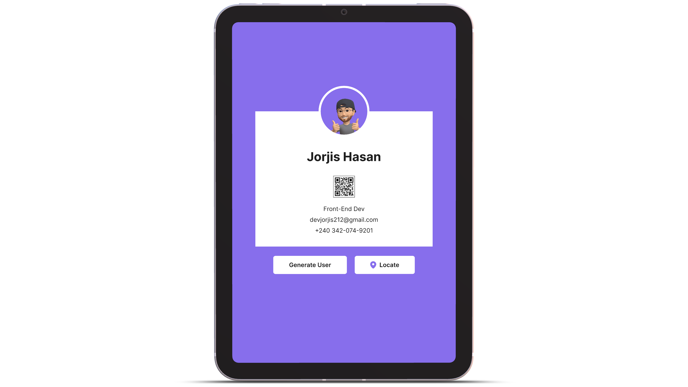

 

# Project itself is pretty self-explanatory. see it [**live**✨](https://pickuser.netlify.app/ "open in a new tab")

## This project covers some micro-intregational parts of UI.

    ✅ API Handling
    ✅ Dom Manipulation
    ✅ Qr Code Generate
    ✅ Deal with Dynamic Data
    ✅ Random Color Generator
    ✅ Dynamic and custom location services

 

## **While completing this project, I worked with three popular API services. :-**

 

- [Qr Code API](https://api.qrserver.com/v1/create-qr-code/?size=150x150&data=Example)
- [Random User Generator](https://random-data-api.com/api/v2/users?response_type=json)
- [Google Map Api](https://developers.google.com/maps/documentation/javascript/)
  - Google Javascript API
  - Google Places API
  - Google Direction API
  - Google Geolocation API
  - Google Geocoding API

## **Written languages**:

    - Vanilla Js [asynchronous-tasks,destructuring,es6-stuffs]
    - HTML5 [semantic syntaxes, BEM convention]
    - CSS3 [structure style]
